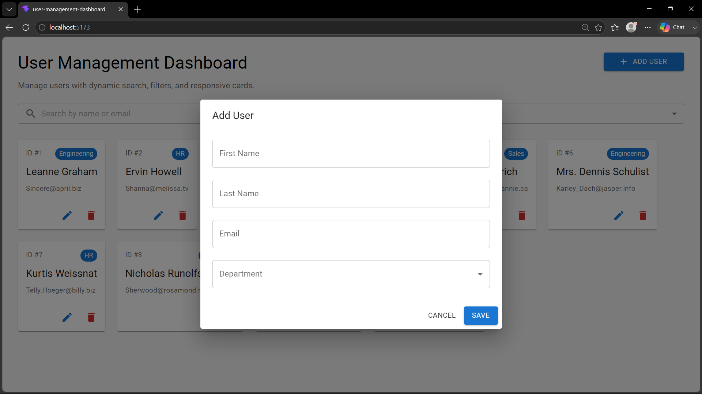
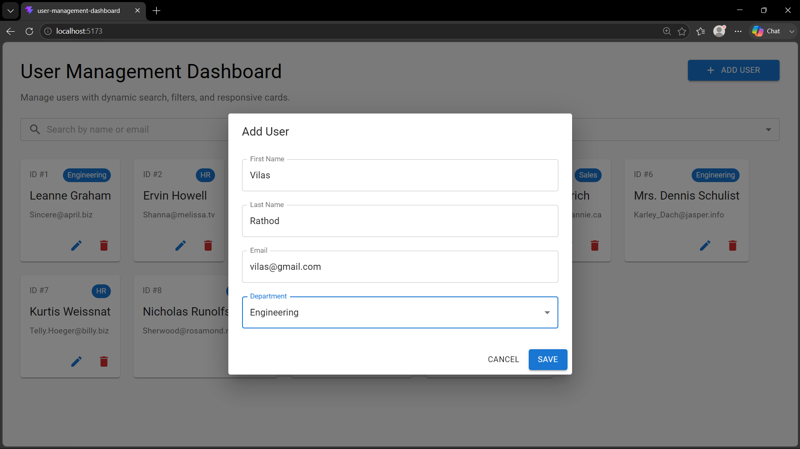
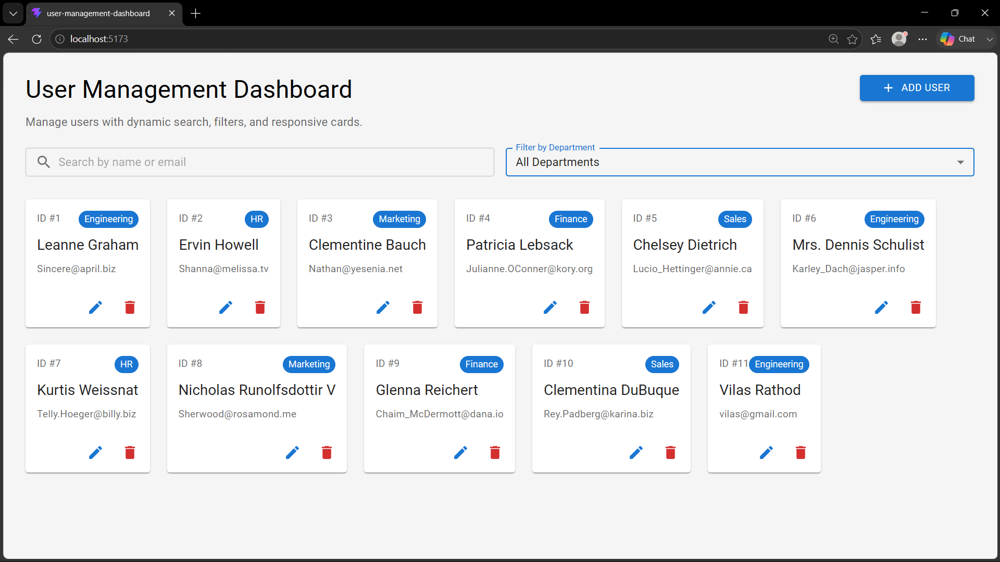
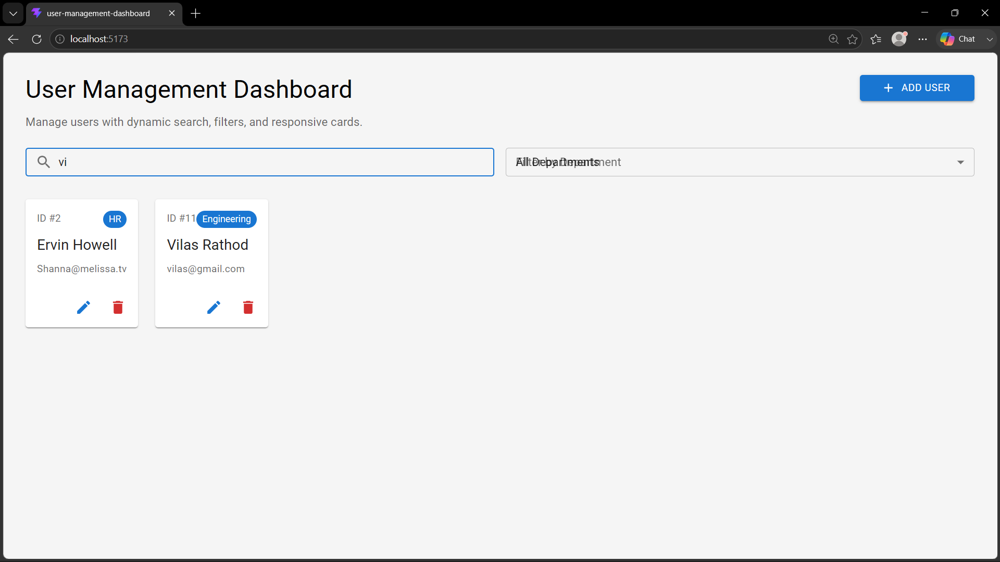

# User Management Dashboard (CRUD)

A simple React + Vite dashboard for managing user details with add, edit, delete, and search capabilities.

## Project Overview

This project is a CRUD web application built using React and Vite. Users can:

- View a list of users loaded from a mock backend API
- Add new users via a modal form
- Edit existing user details
- Delete users with confirmation
- Search and filter users by name, email, or department

## Key Packages and Why They Are Used

- `react` and `react-dom`: Core React libraries for building the UI.
- `vite`: Fast frontend bundler and development server.
- `@vitejs/plugin-react`: Enables React support in Vite.
- `axios`: Handles HTTP requests to the mock API.
- `@mui/material` and `@mui/icons-material`: Provides a responsive, modern UI with ready-made React components.

## Project Structure

- `src/main.jsx` — Application entry point that mounts the React app.
- `src/App.jsx` — Main app shell rendering the dashboard.
- `src/Pages/Dashboard.jsx` — Dashboard page with user list, search, filters, and action controls.
- `Components/UserForm.jsx` — Reusable user form modal for add/edit operations.
- `src/api/userApi.js` — API helpers using Axios.
- `src/api/axios.js` — Axios instance configuration.

## Setup and Run

1. Install dependencies:

```bash
npm install
```

2. Start the development server:

```bash
npm run dev
```

3. Build for production:

```bash
npm run build
```

4. Preview the production build:

```bash
npm run preview
```

---

## Screenshot

| Add User Screen | Edit User Screen | Home View | Search View |
| --- | --- | --- | --- |
|  |  |  |  |

### Screenshot Descriptions

- **Add User**: Shows the modal form used to add a new user with validation on all fields.
- **Edit User**: Demonstrates editing an existing user’s details in the same modal form.
- **Home View**: Displays the main dashboard layout and user cards with department chips.
- **Search View**: Highlights the dynamic search and filter controls for locating users quickly.

---


